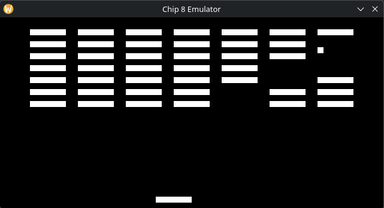

# chip-8-emulator
A Chip8 interpreter and emulator written in C using SDL3

## Features
- Specify classic or modern mode when loading a ROM
- Video, audio, and input powered by SDL3

## Build and Use

Requires:
* [SDL3](https://wiki.libsdl.org/SDL3/FrontPage)
* [pkg-config](https://gitlab.freedesktop.org/pkg-config/pkg-config)
* [gcc](https://gcc.gnu.org/)
* Linux OS

1. cd into install location
2. run `make`
3. run `./build/main { -c | -m } <rom-file-path>`

## Controls

The left shows the normal keyboard inputs and how they are mapped to the traditional Chip8 keypad
|---|---|---|---|---|---|---|---|---|
| 1 | 2 | 3 | 4 | - | 1 | 2 | 3 | C |
| Q | W | E | R | - | 4 | 5 | 6 | D |
| A | S | D | F | - | 7 | 8 | 9 | E |
| Z | X | C | V | - | A | 0 | B | F |

# Tests and Validations

    
 <a href="https://github.com/Timendus/chip8-test-suite">Chip-8 Test Suite by Timendus</a> 

1. ✅ [1-chip8-logo.ch8](https://github.com/Timendus/chip8-test-suite/blob/main/bin/1-chip8-logo.ch8)
2. ✅ [2-ibm-logo.ch8](https://github.com/Timendus/chip8-test-suite/blob/main/bin/2-ibm-logo.ch8)
3. ✅ [3-corax+.ch8](https://github.com/Timendus/chip8-test-suite/blob/main/bin/3-corax%2B.ch8)
4. ✅ [4-flags.ch8](https://github.com/Timendus/chip8-test-suite/blob/main/bin/4-flags.ch8)
5. ⚠️ [5-quirks.ch8](https://github.com/Timendus/chip8-test-suite/blob/main/bin/5-quirks.ch8)
    * Display Wait is not implemented
6. ✅ [6-keypad.ch8](https://github.com/Timendus/chip8-test-suite/blob/main/bin/6-keypad.ch8)
7. ✅ [7-beep.ch8](https://github.com/Timendus/chip8-test-suite/blob/main/bin/7-beep.ch8)
    * Sound is fixed for a low enough MAX_SOUND_LENGTH_MS macro value
8. ❌ [8-scrolling.ch8](https://github.com/Timendus/chip8-test-suite/blob/main/bin/8-scrolling.ch8)
    * Not implemented, this test only applies to the SUPER-CHIP and XO-CHIP

    
 <a hreg="https://github.com/corax89/chip8-test-rom">Chip8 Test Rom by corax89

1. ✅ [test_opcode.ch8](https://github.com/corax89/chip8-test-rom/blob/master/test_opcode.ch8)

# Limitations
* SUPER-CHIP is not implemented
* XO-CHIP is not implemented
* Display wait quirk is not implemented

## Sources:
* https://en.wikipedia.org/wiki/CHIP-8
* https://austinmorlan.com/posts/chip8_emulator
* https://github.com/Timendus/chip8-test-suite
* https://tobiasvl.github.io/blog/write-a-chip-8-emulator
* https://chip8.gulrak.net/
* https://laurencescotford.net/2020/07/25/chip-8-on-the-cosmac-vip-index/